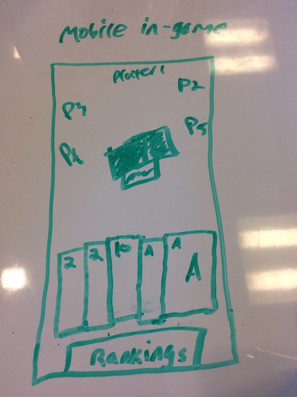
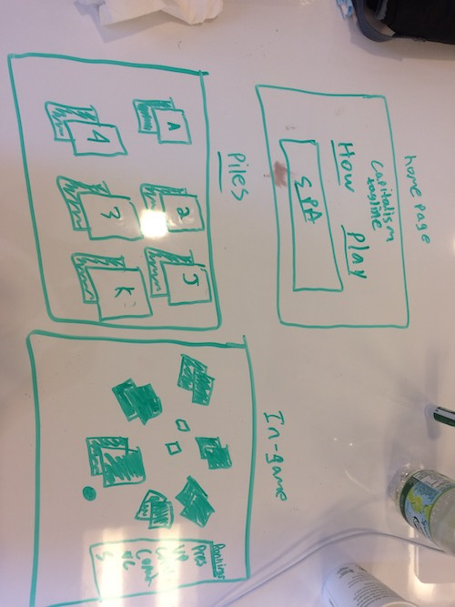
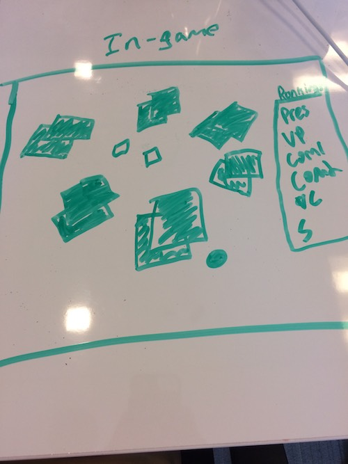
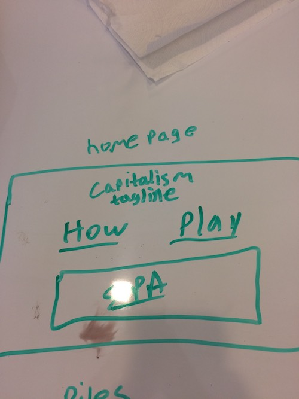
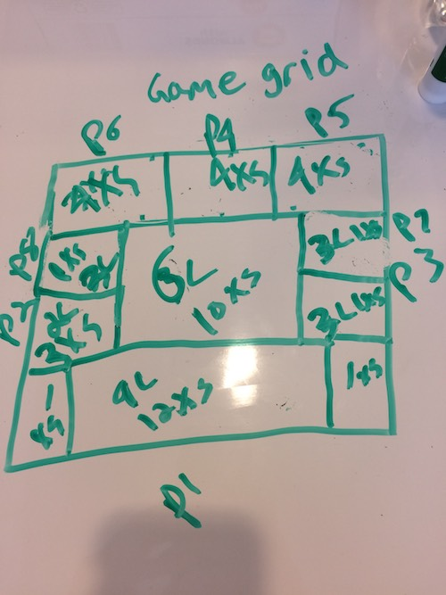

# Capitalism - Be the rich

## Technologies used
- javascript
- Bootstrap
- Jquery
- GitHub
- Future: firebase

## Process
My initial approach was to list the features I wanted quickly and jump directly into coding the first feature. Test that feature. Move on to the next one. Repeat.
However, in a large project with complex logic like this one, failing to plan is failing to plan. Right when I set my eyes on the finish line the code gave out. Adding anything new involved reusing code and breaking pre-existing features. So I stopped. Breathed. And took my expo marker to the white board.
I spent an entire day laying out the proper flow for my app. Then I refactored my existing code to fit the new plan. I repeated that process until my app functioned (almost) without any bugs.
Proper planning is underrated and very useful.

## Future features
- clear the game and play a new one
- persist the rankings of the previous game in order to play the next one
- allow one game to be played on multiple devices at the same damn time

## Bugs
- skipping players doesn't work when players in-between them have finished (should be an easy fix)

## Biggest wins
I love how I was able to properly design, implement, and understand a fully functioning game. I don't believe this game to be trivial either. I also managed myself well enough to stay on track and complete the most necessary features first.

## Biggest challenges
Writing spaghetti code. I need to learn how to not get in my own way by writing bad code.

## Capitalism
- Players: 4-8
- Cards: deal cards out one by one until the deck is done. (some hands will have more cards than others)
- How to win: Get rid of all of your cards as fast as you can.
- Card ranking: 3-Ace. 2 is the bomb card.
- Turns proceed counter-clockwise. Play cards in ascending order always (including doubles, triples, auto completes).
- If a card is played on top of the same ranking card, skip the next player. (i.e. 3 on a 3, ace on an ace)
- If the pile is empty, a player may decide to play doubles or triples if they can.
- **Any pile that starts with doubles can only include doubles**
- **Any pile that starts with triples can only include triples**
- The 2 aka bomb card can be played on any kind of pile. It clears the pile and the player does NOT lose their turn. They start the next pile.
- A completion is when a set of 4 cards of the same rank are played consecutively. If 1 or more cards of the same rank have been played consecutively, then any player who can complete the set to make it 4 in a row can play the remaining card(s) out of turn. This clears the pile and the player who completed does NOT lose their turn. They start the new pile. (i.e. if a 3 has been played, then a player with three 3s can perform a completion. If two 4s have been played, then a player with two 4s can perform a completion. If three 5s have been played, then the player with the remaining 5 can perform a completion.)
- Bombs and completions are the most powerful plays in the game. They allow a player to play 1 or more cards, not lose their turn, and start a new pile. A common technique is to play a 2 then doubles (a total of 3 cards played in a single turn) or hold a 2 until you have only a single or a pair left.
- Auto completions are completions that are performed by a single player in a single turn. The completion set must of a greater rank than the card(s) played before it.
- Players may not end on a 2. If they do, they 'scum out' reserving the bottom-most position in the rankings and bumping everyone else up. If multiple people scum out then they are placed in the order they scummed out. (i.e. Player 1 scums out, then player 2 scums out after. Player 2 becomes Scum 2 and player 1 becomes Scum 1.)
- The first player to win becomes the president, second becomes the vice president, the second to player is scum 1, the last player is scum 2, and those in between are commoners 1, 2, 3 etc.
- For the first round of play the piles are distributed randomly. For all rounds after the hands are selected from President to Scum 2.
- After the first round, the top-most card of each pile is flipped up. If there is a match in another pile, the second card is flipped up. No more cards are flipped up even if there is a second match.
- After the first round, the president may take 2 cards from Scum 2 in exchange for 2 others. The vice president may take 1 card from Scum 1 in exchange for 1 other. The cards being exchanged are dictated by the higher ranking player in the trade. Commoners may trade openly and freely with each other.
- Note: Players who are trading only ask for the card they want. They do not view the other player's hand. Lying is not allowed.

## Github Pages link
- https://github.kdc.capitalone.com/pages/gur648/unit-1-project/

## Github repo link
- https://github.kdc.capitalone.com/gur648/unit-1-project

## Wireframes

## Trello
- https://trello.com/b/X9oSzc3s
